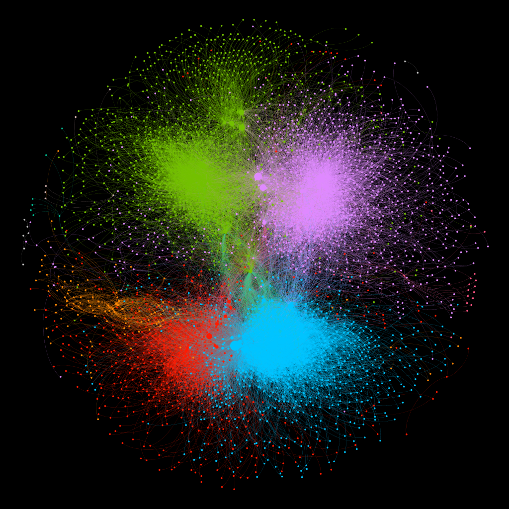
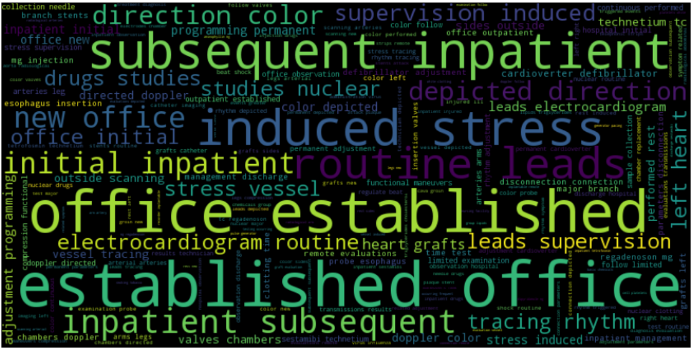
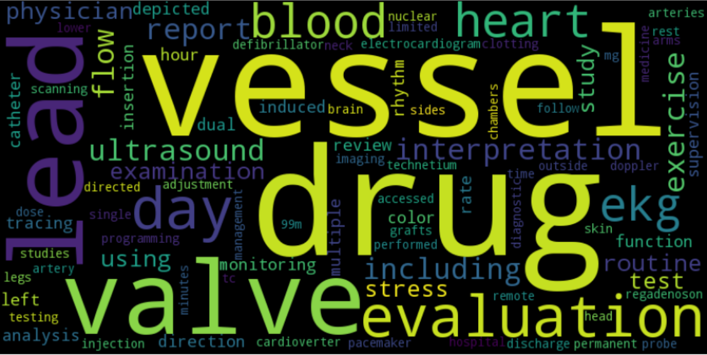
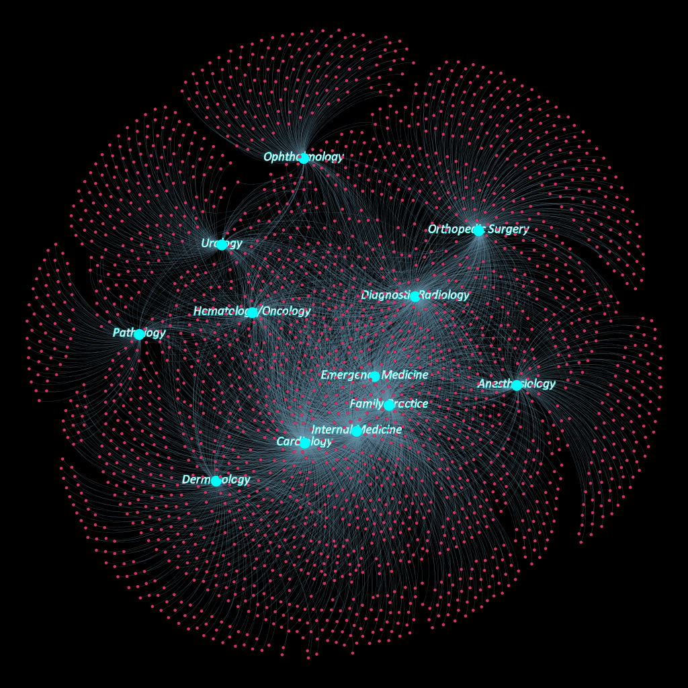

# Doctor Specialty Classification and Network Analysis

For this project, I will try to correctly classify the doctors with missing/unlabelled specialities. The classification will be based off the NLP performed on their procedure description. As another milestone, I've performed complex network analysis to further classify the clustering of different specialties.

This is an early network cluster which I was able to model. The various colors represent different doctor specialties. The heart of the clusters represent the doctors and the nodes towards the outer edges represent the procedures they have performed.

As you can clearly notice, most doctors' procedures are NOT strictly bound to their specialty. They seem to have performed diverse procedures - exhibiting domain expertise and experience.

## Data

Due to the confidential nature of the dataset, it is currently not included in my repo.

## EDA

I've performed exhaustive EDA on the dataset and as a result,obtained several signs of sparse and dense segmentation of data.

## NLP

One of the challenges that I faced during NLP was the repetitive occurance of a few common procedures. These procedures were usually just scheduled visits of inpatients and outpatients of the hospital. This added noise while trying to classify the doctor specialty(in my case - if a Doctor was a Cardiologist or not)

Here is an early WordCloud representation of what my Naive Bayes model thought were important words for classifying wheather a Doctor was a Cardiologist or not.

'office', 'subsequent', 'established' and 'inpatient' are **NOT** important words at all! In fact, these are from the family of the most frquently occuring procedures that involve simple doctor-patient appointments.

I started treating the words that were included in these family of procedures as stopwords and here is the new wordcloud.

This wordcloud looks way more representative than the previous one.

### Is it possible to categorize *ALL* the unlabelled Doctors, given that there is not enough data on them to predicit using NLP?

Absolutely. Here's a glimpse of what's possible by deriving a Network built off of Doctor-Procedure connections in the dataset.

